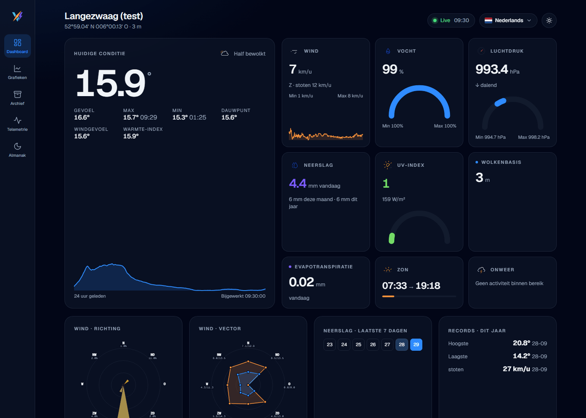

# Vane — WeeWX Theme

A custom, modern WeeWX skin: light/dark, multilingual, lightweight
client-side charts, and sensor-agnostic (works unchanged across a station
swap, e.g. WeatherFlow Tempest → Ecowitt). Successor to
[NeoWX Material](https://neoground.com/en/open-source/neowx-material), not
as a copy but as a lighter, more modern build of its own.

## Status

Working and tested against a real WeeWX install with live WeatherFlow
Tempest data (not just the Simulator): Dashboard, Graphs, Archive, Telemetry
and Almanac are all there, including a wind rose, wind-vector radar, rain
calendar, records teaser and multilingual support (NL/EN). See
`docs/DASHBOARD_EXPANSION_PLAN.md` for the status per component.



## Installing

See **[INSTALL.md](INSTALL.md)** for the full install/update instructions
(building the zip, pip vs. package install, updating).

Short version:

```bash
python build.py
weectl extension install dist/vane-<version>.zip
sudo systemctl restart weewx
```

## Directory structure

- [`docs/`](docs/) — the plans and decisions (see below)
- [`skins/Vane/`](skins/Vane/) — the actual WeeWX skin (Cheetah templates, CSS, JS)
- [`bin/user/vane_extras.py`](bin/user/vane_extras.py) — search-list extension
  (sensor detection, wind-rose/wind-vector calculations, SVG helpers)
- [`install.py`](install.py) — WeeWX `ExtensionInstaller`
- [`build.py`](build.py) — builds the installable zip from `install.py`'s own file list
- [`design/`](design/) — design work: `mockup-handoff/` (Claude Design export),
  `chart-test/` (uPlot vs. own-SVG benchmark), `wsl-test-output/` (generated
  test output, git-ignored)
- [`reference/`](reference/) — input material, not part of Vane itself
  (a live `weewx.conf` with passwords, the full source of the NeoWX
  Material theme) — see `reference/README.md`. Sensitive/third-party files
  in here are **git-ignored**.

## Documentation

- [`docs/DESIGN_PLAN.md`](docs/DESIGN_PLAN.md) — visual design: colors, typography,
  components, pages, sensor-agnostic tile design.
- [`docs/THEME_PLAN.md`](docs/THEME_PLAN.md) — technical plan: WeeWX skin architecture,
  sensor-agnostic `[[Tiles]]` configuration, data strategy (uPlot), i18n, distribution.
- [`docs/DASHBOARD_EXPANSION_PLAN.md`](docs/DASHBOARD_EXPANSION_PLAN.md) —
  research into other WeeWX skins/weather sites, a phased expansion plan and
  the status of what's actually been built from it.
- [`docs/MOCKUP_REVIEW.md`](docs/MOCKUP_REVIEW.md) — findings on the
  original Claude Design mockup.
- [`INSTALL.md`](INSTALL.md) — install/update.

## References / competitive research

| Skin | Key trait | Charting |
|---|---|---|
| [NeoWX Material](https://neoground.com/en/open-source/neowx-material) | current theme, 19 color themes, mature | ApexCharts |
| [weewx-belchertown](https://github.com/poblabs/weewx-belchertown) | live updates via MQTT/websockets, forecast | Highcharts (license!) |
| [Weather34](https://github.com/Drealine/weewx-Weather34) | gauge-driven templates | own |
| [weewx-wdc](https://github.com/Daveiano/weewx-wdc) | IBM Carbon + Nivo, lots of widgets | Nivo (React stack) |
| [weewx-aganetwx](https://github.com/aganet/weewx-aganetwx) | i18n, dark mode, sensor-agnostic | Apache ECharts |

See `docs/THEME_PLAN.md` and `docs/DASHBOARD_EXPANSION_PLAN.md` for the full
trade-off and chosen direction.

## Requirements

- WeeWX 5.x
- Python 3.7+ (for the skin generator/installer)
- No build step for the frontend (vanilla JS, no framework) — keeps it light
  and easy to maintain.

## License

[MIT](LICENSE) — same as most reference skins above. Vane also uses a small
number of MIT/OFL-licensed third-party libraries (Meteocons weather icons,
uPlot, MQTT.js, the Geist font) — see
[THIRD-PARTY-LICENSES.md](THIRD-PARTY-LICENSES.md) for details.
